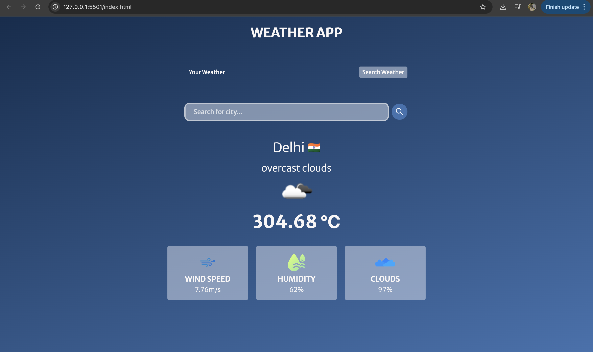

# 🌤️ Weather App

A simple weather app built with **HTML**, **CSS**, and **JavaScript**. It shows real-time weather info like temperature, humidity, and wind speed using the **OpenWeatherMap API**.

> Built by following Love Babbar's Dot Batch Tutorial

---

## 🔧 Features

- 🌆 Search weather by city
- 🌡️ Temperature, humidity & wind speed
- 📱 Responsive design

---

## 🚀 How to Use

1. Clone the repo:
   ```bash
   git clone (https://github.com/Ankushpainuly/Weather-App-JavaScript.git)
   
2. Open index.html in your browser

3. Get an API key from OpenWeatherMap

4. Replace "YOUR_API_KEY" in script.js with your key

📸 Screenshot


🙌 Credits
Love Babbar

OpenWeatherMap
